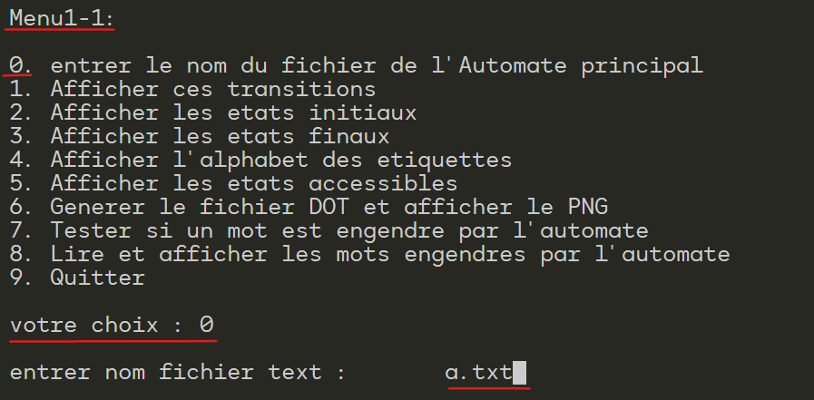

# Automata Theory Project

## Description
This project is an implementation of various operations on automata, as defined in automata theory. It includes functionality to store, manipulate, and visualize automata using text files representing transitions, initial and final states.

## Features
- Read automata from text files.
- Display transitions, initial, and final states.
- Generate DOT files and visualize automata as PNG images.
- Perform automata operations such as union, product, and star.
- Remove epsilon transitions from automata.

## Visualizations
Below are the visualizations of the automata before and after various operations performed:

### Initial Automatons

 - #### automaton a

 - #### automaton b

### Automatons After Union Operation

### Automatons After Product Operation

### Automaton b After Kleene Star(Etoile) Operation

### Epsilon transitions suppression

- #### Before 

- #### After 

## Getting Started
To get started with this project:

1. Clone this repository to your local machine.
2. Compile the C source code using a compiler like GCC.
3. Run the compiled executable to interact with the program.

## How to Use
The project provides an interactive menu-driven console application. Compile and run the program, then follow the prompts to select from the available operations.
 *don't forget to choose option 0 to submit the automaton's text file when navigating twords Menu1-1 in order to operate on it.*

## Technologies
- C programming language.
- Graphviz for automata visualization.

---