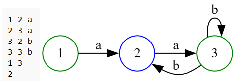

# Automata Theory Project

## Description
This project is an implementation of various operations on automata, as defined in automata theory. It includes functionality to store, manipulate, and visualize automata using text files representing transitions, initial and final states.

## Features
- Read automata from text files.
- Display transitions, initial, and final states.
- Generate DOT files and visualize automata as PNG images.
- Perform automata operations such as union, product, and star.
- Remove epsilon transitions from automata.

### Initial Automatons
 
 
